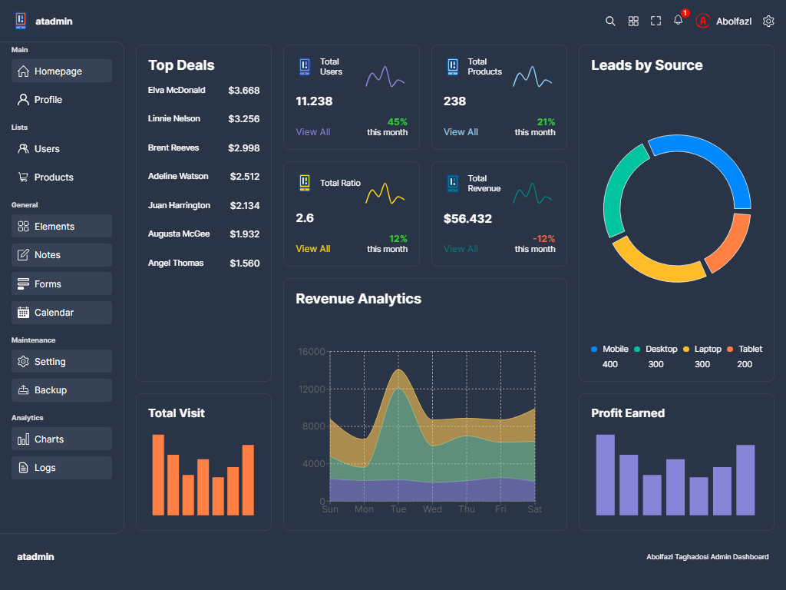
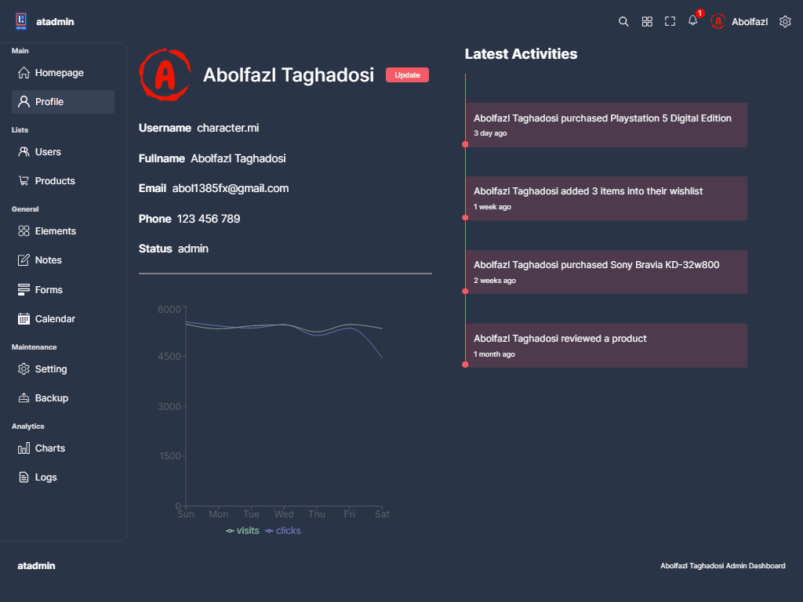
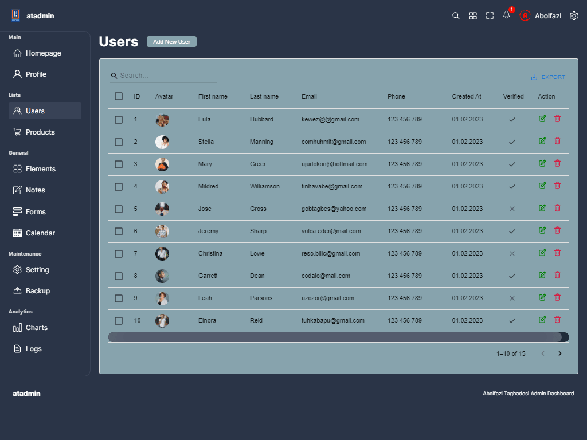
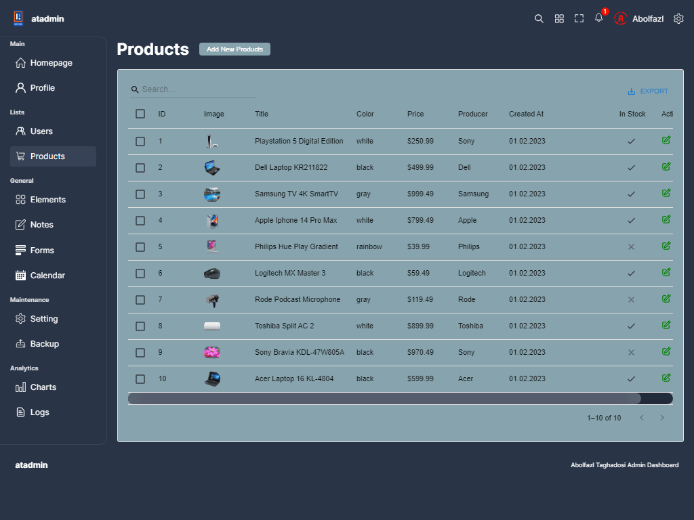
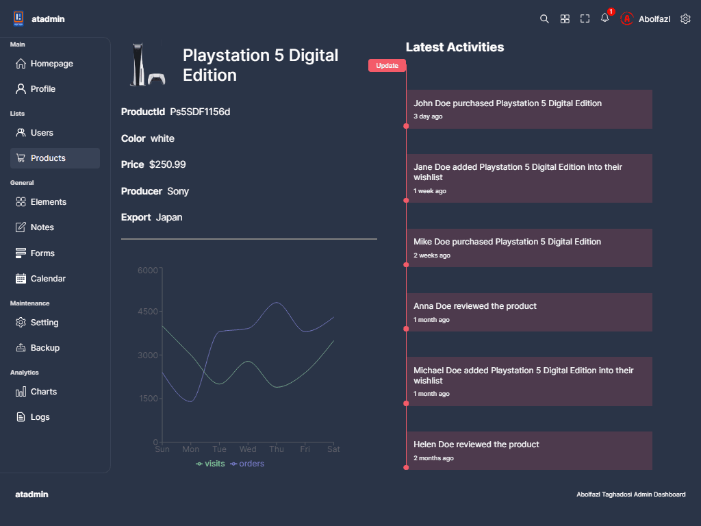
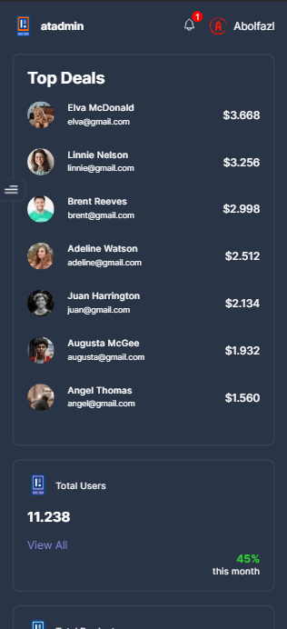

# 📱 Admin Dashboard

### a fully responsive admin dashboard application with a good UI/UX. also first project using typescript and react together.

## Link 🔗 [https://admin-dashboard-app-lovat.vercel.app](https://admin-dashboard-app-lovat.vercel.app)

 

# Preview

 

# Mobile Responsive

# Technologies

 

<ul>
    <li>
        
    </li>
    <li>
        
    </li>
    <li>
        
    </li>
    <li>
        
    </li>
</ul>
